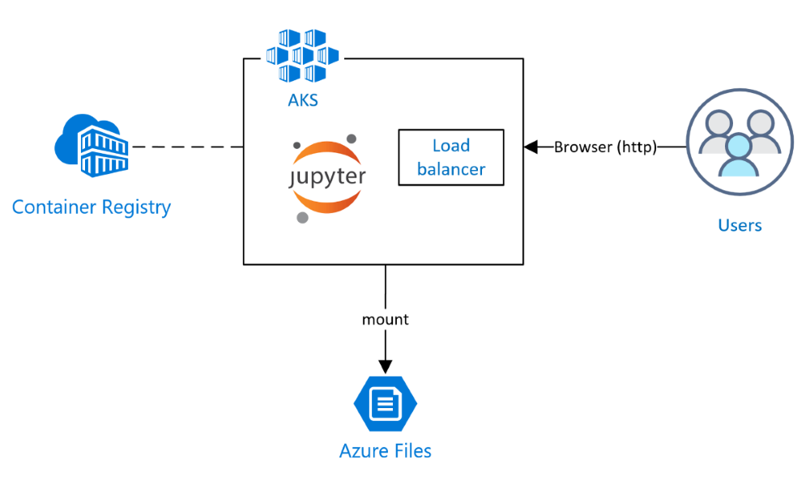
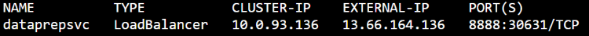
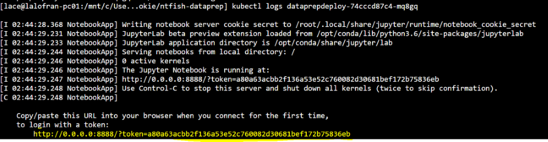

# NT Fisheries - Frame Reduction Container

## Overview

This contains the Frame Reduction Container app for the NT Fisheries Fish Monitoring Solution. The app extracts and proposes frames containing fish from videos taken from the NT Fisheries BRUV. 

## Architecture

This app is implemented as a Python package, exposed and run in a [Jupyter](http://jupyter.org/) notebook, packaged up in a [Docker](https://www.docker.com/) container and pushed to [Azure Container Registry (ACR)](https://docs.microsoft.com/en-us/azure/container-registry/). The app is hosted in a [Kubernetes](https://kubernetes.io/) cluster on [Azure Kubernetes Service (AKS)](https://docs.microsoft.com/en-us/azure/aks/). Currently, it's designed to consume video files hosted on [Azure Files](https://docs.microsoft.com/en-us/azure/storage/files/storage-files-introduction), which is [mounted as a volume on AKS](https://docs.microsoft.com/en-us/azure/aks/azure-files-volume). The application is parameterize using environment variables. See env-template for the required environment variables.

## Deploy

### Requirements:
- [az cli](https://docs.microsoft.com/en-us/cli/azure/?view=azure-cli-latest)
- [docker](https://www.docker.com/)
- [kubectl](https://kubernetes.io/docs/tasks/tools/install-kubectl/)

### Deployment:
The following shows how to deploy the solution to azure:

1. Ensure you are logged in the azure cli. Use `az login` to login.
2. Open **deploy/deploy.sh** and change deployment parameters at the top of the script. Save the script.
3. Run `./deploy/deploy.sh`. 
    - NOTE: that this does NOT deploy Azure Files as part of the deployment.
    - NOTE: this will also configure your kubectl to point to the newly deployed AKS cluster
4. After deployment has completed, open **deploy/kube/dataprep.yaml** and update the image so its pointing to the newly deployed image in ACR.
5. Deploy the application to AKS by running `kubectl apply -f deploy/kube/dataprep.yaml`

### Access application:
To access the application, open a browser and go to `http:<PublicIP_of_loadbalancer_on_cluster>:8888/?token=<jupyter_token>`
- You can retrieve the public IP by running `kubectl get services`. For example:

    
- You can retrieve the token of the Jupyter server by inspecting the logs of the pods.
    1. Run `kubectl get pods`
    2. Run `kubectl logs <pod_name>`

## Project Organization
------------

    ├── LICENSE
    ├── Makefile           <- Makefile with commands like `make data` or `make train`
    ├── README.md          <- The top-level README for developers using this project.
    ├── data
    │   └── raw            <- This contains a sample video file.
    │
    ├── deploy
    │   └── kube            <- Contains kubernetes deployment template
    |   ├──deploy.sh        <- Deployment script
    │
    ├── docs               <- A default Sphinx project; see sphinx-doc.org for details
    │
    ├── models             <- Trained and serialized models, model predictions, or model summaries
    │
    ├── notebooks          <- Jupyter notebooks. 
    │
    ├── requirements.txt   <- The requirements file for reproducing the analysis environment, e.g.
    │                         generated with `pip freeze > requirements.txt`
    │
    ├── setup.py           <- makes project pip installable (pip install -e .) so src can be imported
    ├── src                <- Source code for use in this project.
    │   ├── __init__.py    <- Makes src a Python module
    │   │
    │   ├── data           <- Main folder with python scripts
    │
    └── DockerFile

--------

<small>Project based on the <a target="_blank" href="https://drivendata.github.io/cookiecutter-data-science/">cookiecutter data science project template</a>. #cookiecutterdatascience</small>

