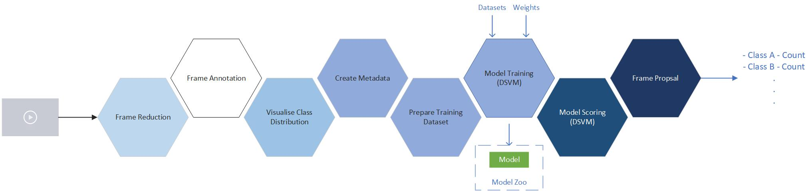

## Instance Segmentation Pipeline - Mask R-CNN, PyTorch

* Frame Reduction and Proposal - From a video, retain only the frames consisting of the visual content you're interested in, using the [Cognitive Services, Scence and Activity Recognition Service](https://azure.microsoft.com/en-us/services/cognitive-services/computer-vision/#analyze).
* Frame Annotation
* Visualise Class Distribution
* Prepare Training Dataset
* View Training Dataset
* Model Training
* Model Scoring
    * Image
    * Video

### Credits
* [multimodallearning](https://github.com/multimodallearning) / [pytorch-mask-rcnn](https://github.com/multimodallearning/pytorch-mask-rcnn)
* [michhar](https://github.com/michhar) / [custom-jupyterhub-linux-vm](https://github.com/michhar/custom-jupyterhub-linux-vm)
* [Azadehkhojandi](https://github.com/Azadehkhojandi) / [computer-vision-fish-frame-proposal](https://github.com/Azadehkhojandi/computer-vision-fish-frame-proposal)